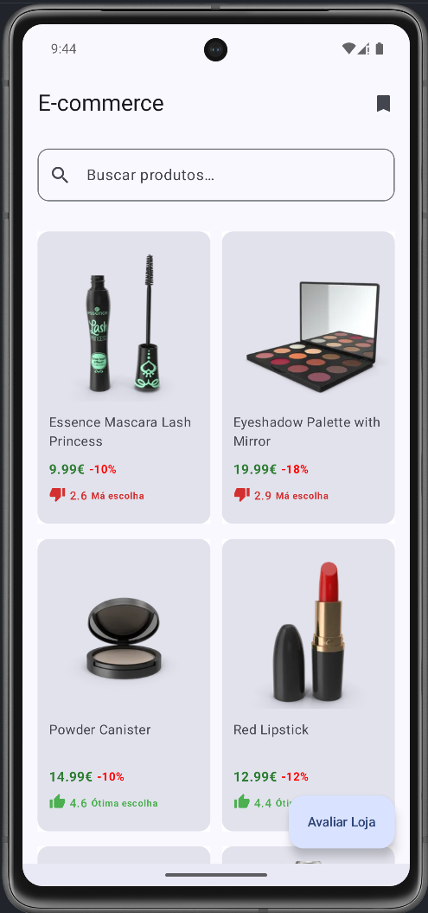
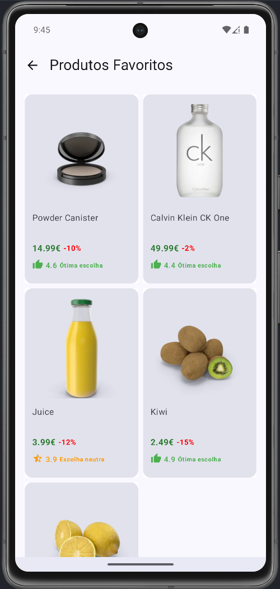
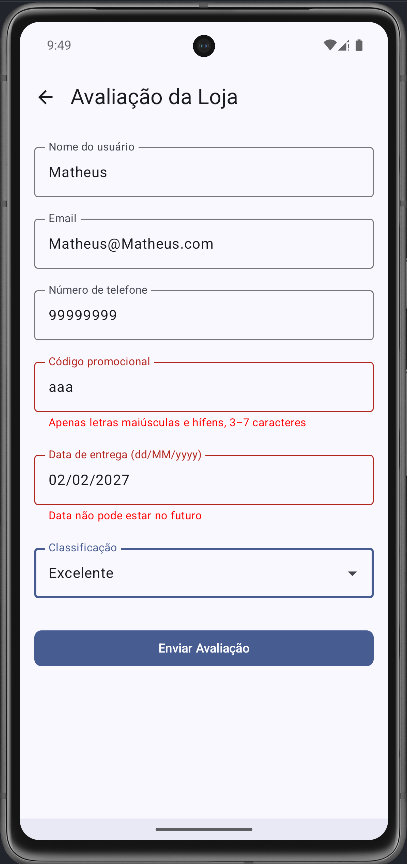

# E-commerce App

Aplicativo Android simulando uma loja online: mostrando uma lista de produtos e seus detalhes.
O projeto é estruturado com Arquitetura Hexagonal, MVVM, Jetpack Compose, Retrofit, Multi módulo e mais.

* * *

* ## O que foi implementado:
  * Lista de produtos buscada da API DummyJSON. [endpoint](https://dummyjson.com/products)
  * Indicador de carregamento ao aguardar resposta da API.
  * Tratamento de erros (ex: Se não há conexão)
  * Tela de detalhes do produto mostrando mais informações sobre o produto, como preço, desconto, estoque, rating, etc.
  * Paginação na lista de produtos.
  * Busca em tempo real por nome ou descrição do produto.
  * Ícones customizados por categoria de rating: <3, 3–4, >4

* ## Quais são os conceitos-chave deste projeto:
  * Arquitetura Hexagonal
  * Jetpack Compose
  * Projeto Multi Módulo
  * Jetpack Compose Navigation
  * ViewModel

* ## Quais bibliotecas foram utilizadas:
  * Retrofit - Interface e cliente para a API, tem boa integração com Kotlin Coroutines
  * OkHttp - Para dar suporte ao Retrofit
  * Gson - Converte JSON para objetos e objetos para JSON
  * Jetpack ViewModel - Para suportar estados reativos
  * Kotlin Coroutines - Para fazer chamadas assíncronas
  * Dagger/Hilt - Injeção de dependência
  * Compose Coil - Para carregar imagens
  * Mockk - criar objetos mockados quando testando
  * JUnit - Testes

* * *
* ## Por que Arquitetura Hexagonal?
    * Para criar um fluxo de dependências apontando para dentro (dos Módulos para o Domínio). Assim nosso domínio fica livre de dependências e podemos focar na lógica de negócio sem nos preocupar com coisas técnicas do Android.
      

* ## Demonstração
*  
*  
*  
*  

* * *
* ## Email
* E-mail: matheusfelipecorreaalves@gmail.com
